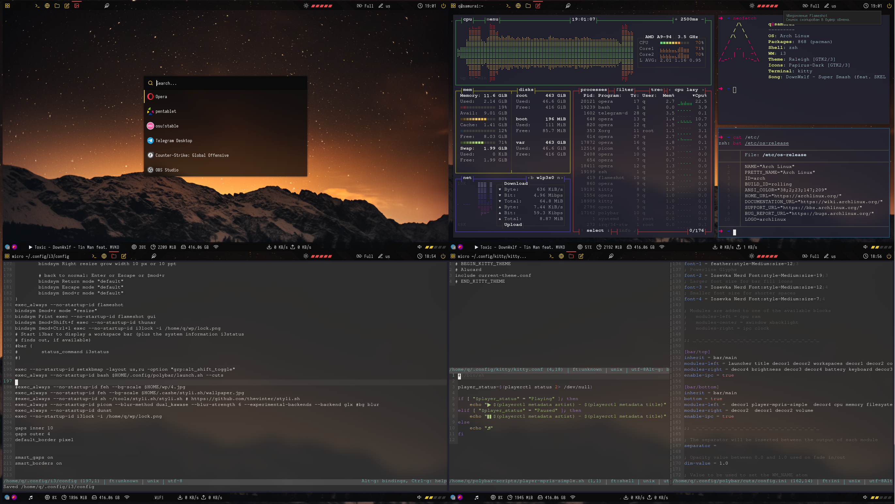
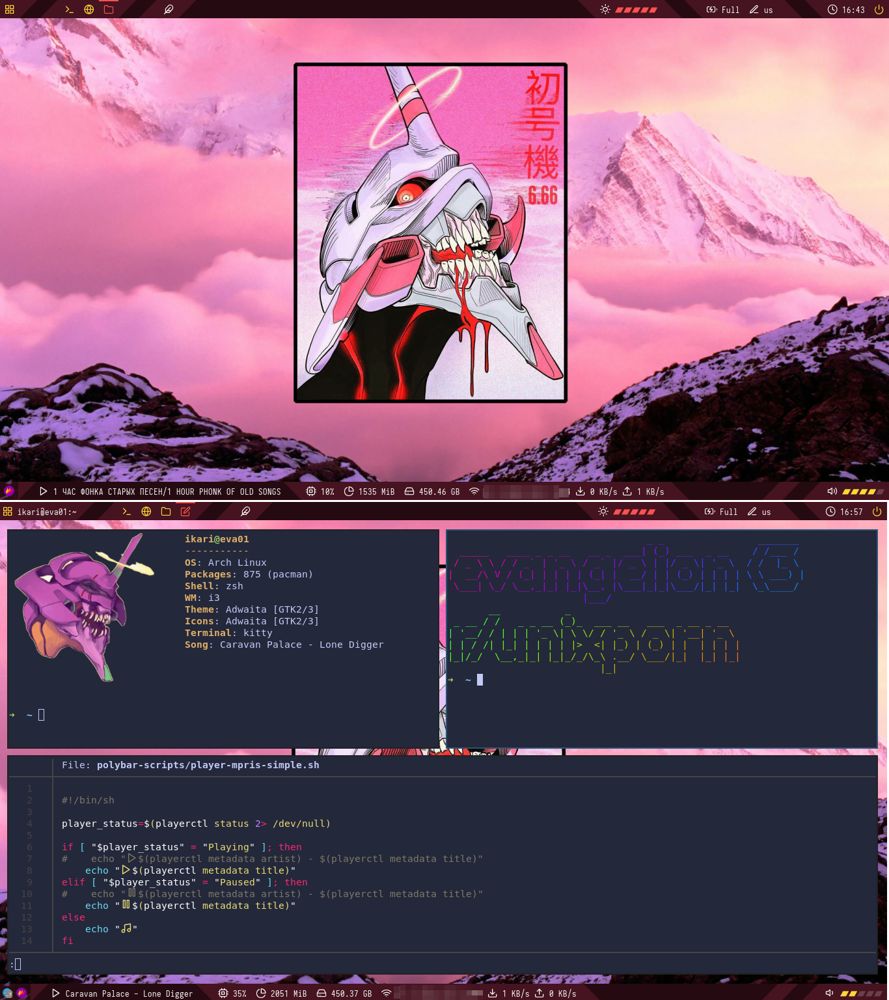
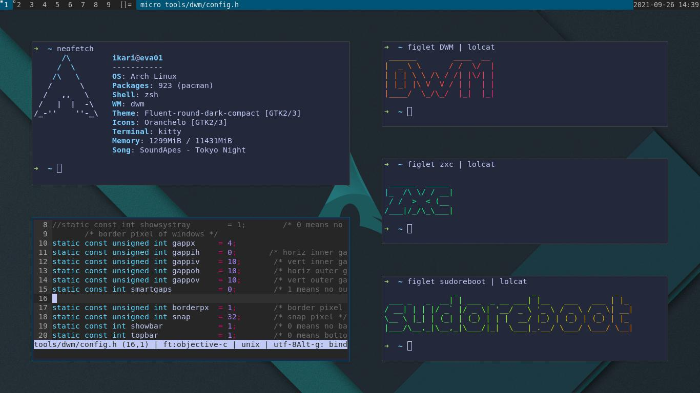

# dotfiles

# New sway


# bspwm


# For bspwm and i3
install https://github.com/adi1090x/polybar-themes

# i3


# i3 2.0


# i3 evadgelion ed


# DWM


```zsh
#.xinitrc
setxkbmap -layout us,ru -option "grp:alt_shift_toggle" & 
feh --bg-scale /home/ikari/Загрузки/6.jpg &
#opentabletdriver
otd &
#время
while true; do
   xsetroot -name "$( date +"%F %R" )"
   sleep 1m    # Update time every minute
done &


exec dwm
